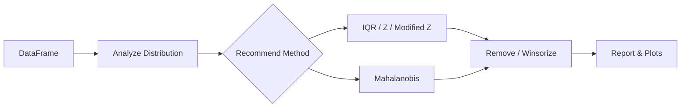

# StatClean

Data preprocessing & outlier detection with formal statistical methods and publication-quality reporting.

> Note: Remover methods return `self`. Access cleaned data via `cleaner.clean_df` and details via `cleaner.outlier_info`.

## Quick Links

| Getting Started | Learn |
|---|---|
| [[Installation Guide|Installation-Guide]] | [[Statistical Methods|Statistical-Methods-Guide]] |
| [[Quick Start Tutorial|Quick-Start-Tutorial]] | [[API Reference|API-Reference]] |
| [[Advanced Examples|Advanced-Examples]] | [[Performance Tips|Performance-Tips]] |
| [[Troubleshooting|Troubleshooting]] | [[Contributing|Contributing]] |

## Feature Overview

| Feature | Univariate | Multivariate | Formal Test |
|---|---:|---:|---:|
| IQR | ✅ |  |  |
| Z-score | ✅ |  |  |
| Modified Z-score | ✅ |  |  |
| Mahalanobis |  | ✅ |  |
| Grubbs | ✅ |  | ✅ |
| Dixon Q | ✅ |  | ✅ |

## How It Flows

[Back to top](#statclean)
