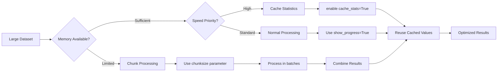

# Performance Tips

## Optimization Workflow



<details>
<summary><strong>Large Datasets</strong></summary>

For datasets with >100k rows:

```python
# Use batch processing
cleaner.clean_columns(columns, show_progress=True)

# Cache statistics for repeated operations
cleaner.add_zscore_columns(columns, cache_stats=True)
```

</details>

<details>
<summary><strong>Memory Optimization</strong></summary>

```python
# Process columns individually for memory efficiency
for col in large_columns:
    cleaner.remove_outliers_zscore(col)
    
# Use in-place operations when possible
cleaner = StatClean(df, preserve_index=False)
```

</details>

<details>
<summary><strong>Multivariate Performance</strong></summary>

```python
# For many variables, consider dimensionality reduction first
from sklearn.decomposition import PCA
pca_data = PCA(n_components=5).fit_transform(df)
```

</details>

## See Also

- [[API Reference|API-Reference]] - Method signatures and parameters
- [[Advanced Examples|Advanced-Examples]] - Large dataset examples
- [[Statistical Methods Guide|Statistical-Methods-Guide]] - Understanding method efficiency
- [[Troubleshooting|Troubleshooting]] - Memory and performance issues

[Back to top](#performance-tips)
