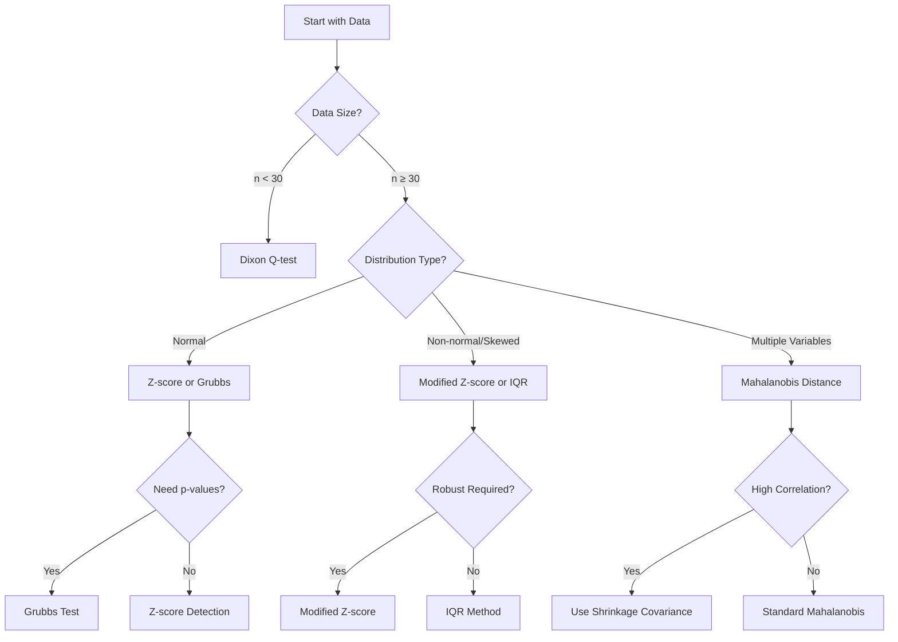

# Statistical Methods Guide

## Method Selection Guide

## Univariate Methods
- IQR: robust to non-normal data; configure lower/upper factors.
- Z-score: assumes approximate normality; configurable threshold.
- Modified Z-score: robust via MAD; default threshold 3.5.

## Multivariate Methods
- Mahalanobis distance: detects multivariate outliers using covariance structure.
  - `chi2_threshold`: percentile in (0,1] or absolute chi-square statistic.
  - `use_shrinkage=True` to enable Ledoit–Wolf covariance if scikit-learn available.

## Formal Tests
- Grubbs' test: single outlier detection with p-value and critical value.
- Dixon's Q-test: for small n (<30); approximate p-value reported.

## Transformations
- Box-Cox (positive data): optimal lambda estimated; preserves NaNs.
- Log (natural, base 10, base 2): shifts applied for non-positive values.
- Square-root: shifts applied for negatives.

Best practices: drop NaNs before tests where needed; sample large data for Shapiro.

> Warning: Dixon’s Q-test is recommended only for small sample sizes (n < 30).

## See Also

- [[API Reference|API-Reference]] - Complete method documentation
- [[Advanced Examples|Advanced-Examples]] - Real-world usage of statistical methods
- [[Performance Tips|Performance-Tips]] - Optimization for large datasets
- [[Quick Start Tutorial|Quick-Start-Tutorial]] - Basic usage examples

[Back to top](#statistical-methods-guide)
