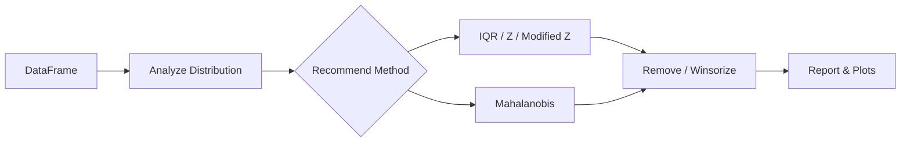

# Welcome to StatClean

Data preprocessing & outlier detection with formal statistical methods and publication-quality reporting.

[](https://pypi.org/project/statclean/)
[](https://github.com/SubaashNair/StatClean/actions)
[](../LICENSE)

> Note: Remover methods return `self`. Access cleaned data via `cleaner.clean_df` and details via `cleaner.outlier_info`.

## Quick Start

```bash
pip install statclean
```

```python
from statclean import StatClean
import pandas as pd

df = pd.DataFrame({'values': [1, 2, 3, 100, 4, 5]})
cleaner = StatClean(df)
cleaner.remove_outliers_zscore('values')
cleaned_df = cleaner.clean_df
```

## Feature Overview

| Feature | Univariate | Multivariate | Formal Test |
|---|---:|---:|---:|
| IQR | ✅ |  |  |
| Z-score | ✅ |  |  |
| Modified Z-score | ✅ |  |  |
| Mahalanobis |  | ✅ |  |
| Grubbs | ✅ |  | ✅ |
| Dixon Q | ✅ |  | ✅ |

## How It Flows



## Navigation

- [Installation Guide](installation.md)
- [Quick Start Examples](examples.md)
- [Statistical Methods](statistical-methods.md)
- [API Reference](api-reference.md)

## Links

- [GitHub Repository](https://github.com/SubaashNair/StatClean)
- [PyPI Package](https://pypi.org/project/statclean/)
- [Issue Tracker](https://github.com/SubaashNair/StatClean/issues)